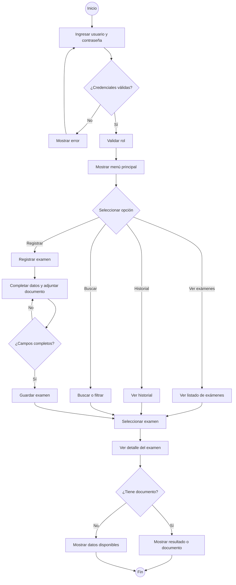

# Ofta App

Aplicación móvil desarrollada para registrar y consultar exámenes oftalmológicos utilizando datos ficticios. El proyecto busca organizar la información de los pacientes y sus exámenes, facilitando su consulta desde una aplicación móvil.

## MVP

* Inicio de sesión con usuarios y roles ficticios.
* Registro y consulta de exámenes oftalmológicos.
* Visualización de información de pacientes.
* Historial de exámenes.
* Búsqueda y consulta de información.
* Visualización del detalle de cada examen.
* Uso de datos ficticios para representar la información del sistema.

## Tecnologías utilizadas

* Kotlin
* Android Studio
* Jetpack Compose
* Arquitectura MVVM

## Arquitectura del proyecto

El proyecto utiliza una arquitectura **MVVM (Model-View-ViewModel)** para separar las responsabilidades de los datos, la lógica de la aplicación y la interfaz de usuario.

### Model

Contiene las entidades principales de la aplicación. En este proyecto se utilizan las clases:

* `Paciente`: representa la información de un paciente.
* `ExamenOftalmologico`: representa la información correspondiente a un examen oftalmológico.

### Repository

Se encarga de administrar y proporcionar los datos utilizados por la aplicación.

* `ExamenRepository`: contiene y entrega los datos de los exámenes oftalmológicos. Actualmente trabaja con datos en memoria, sin utilizar una base de datos ni una API.

### ViewModel

Se encarga de mantener el estado de la aplicación y manejar las acciones relacionadas con los datos.

* `ExamenViewModel`: mantiene el estado de los exámenes y permite realizar acciones relacionadas con la información que se muestra en la pantalla.

### UI

Contiene las pantallas y componentes visuales desarrollados con Jetpack Compose.

* `ExamenesScreen`: pantalla encargada de mostrar el listado de exámenes.
* `ExamenCard`: componente reutilizable encargado de mostrar la información de un examen.

## Estructura del proyecto

```text
app/src/main/java/com/equipo7/oftaapp/
│
├── model/
│   ├── Paciente.kt
│   └── ExamenOftalmologico.kt
│
├── repository/
│   └── ExamenRepository.kt
│
├── viewmodel/
│   └── ExamenViewModel.kt
│
└── ui/
    ├── components/
    │   └── ExamenCard.kt
    │
    ├── screens/
    │   └── ExamenesScreen.kt
    │
    └── theme/
        ├── Color.kt
        ├── Theme.kt
        └── Type.kt
```

## Flujo principal



## Identidad visual

* Principal: `#0B7A63`
* Secundario: `#4DB6AC`
* Fondo: `#F4FAF8`
* Texto: `#212121`
* Blanco: `#FFFFFF`

## Estado actual del proyecto

El proyecto cuenta con una estructura inicial basada en MVVM, incluyendo las entidades principales, un Repository para manejar los datos, un ViewModel para administrar el estado y las acciones, y componentes y pantallas desarrollados con Jetpack Compose.

En esta etapa se trabaja con datos en memoria. No se requiere implementar Room, Firebase ni una API REST, ya que el objetivo es demostrar la separación de responsabilidades mediante la arquitectura MVVM.
