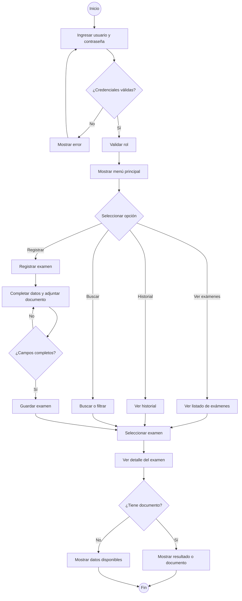

# Ofta App

Aplicación móvil para registrar y consultar exámenes oftalmológicos usando datos ficticios. La idea es ordenar la información que actualmente puede estar repartida entre distintos archivos y correos.

## MVP
- Inicio de sesión con usuarios y roles ficticios.
- Registro y consulta de exámenes.
- Documentos de resultados simulados.
- Historial de exámenes.
- Búsqueda y filtros básicos.
- Estado y resumen del resultado.

## Identidad visual
- Principal: `#0B7A63`
- Secundario: `#4DB6AC`
- Fondo: `#F4FAF8`
- Texto: `#212121`
- Blanco: `#FFFFFF`

## Flujo principal

## Interfaces
Las imágenes están en `docs/diseno/interfaces/`.

- `login.png`
- `menu-principal.png`
- `registrar-examen.png`
- `listado-busqueda.png`
- `historial.png`
- `detalle-examen.png`

## Material Design 3
Se consideran principalmente `TopAppBar`, `NavigationBar`, `Card`, `Button`, `TextField` y `FloatingActionButton`, según la pantalla.

## Integrantes
- Diego Andres Diaz Hernandez — Backend y desarrollo
- Martin Andres Diaz Gonzalez — Líder y frontend

## Evidencias
- Clase 1: `docs/evidencias/clase-01/Evidencia_Clase_01_MVP_Equipo07.docx`
- Clase 2: `docs/evidencias/clase-02/Evidencia_Clase_02_Diseno_Equipo07.docx`
